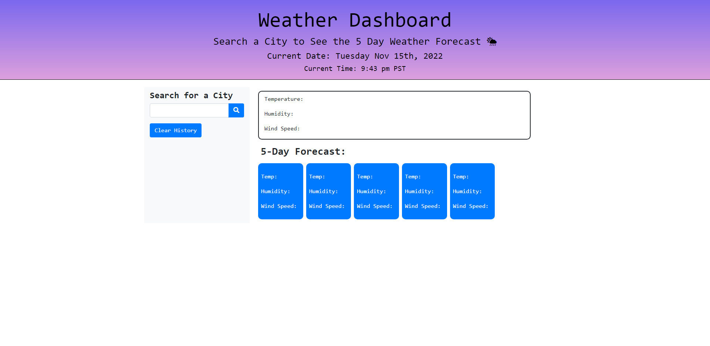

# John Kang, Challenge 6: Weather App 
The purpose of this assigment was to create a weather forecast application that will provide users with a curretn weather forecast as well as a 5 day forecast. The application will show users the temperature, humidity and wind speed for boththe current as well as the 5 day forecast. The application will store the previously searched cities under the search bar to it is easy to compare the weather for different locations. 

## Screenshot of deployed website 
 

### Deployed Site 
https://jyk33.github.io/creating-a-weatherapp/